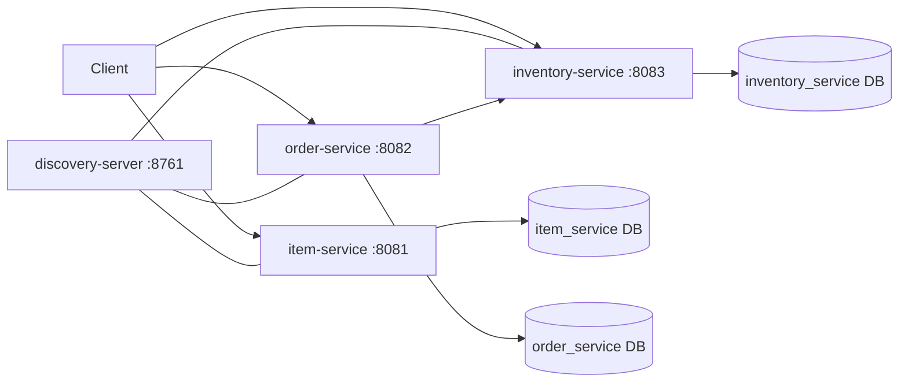

# CNKart Microservices

Spring Boot microservice suite for a simple e-commerce workflow with separate services for catalog items, inventory checks, order placement, and service discovery.

## Overview

CNKart started as a monolithic REST API and is now organized as a small microservice system. The split gives each business concern its own lifecycle, which makes the project easier to reason about and a better fit for distributed-systems learning.

The services work together like this:

- `item` manages catalog items.
- `inventory` checks stock availability for a requested SKU and quantity.
- `order` places orders after checking inventory and uses a fallback when inventory is unavailable.
- `discovery-server` acts as the Eureka registry for the service suite.

## Concepts / Features Covered

- Spring Boot REST APIs
- Spring Data JPA persistence
- MySQL-backed service databases
- Eureka service discovery
- OpenFeign-based service-to-service communication
- Hystrix fallback handling in the order flow
- Service-local configuration files for each module
- Independent service startup and runtime lifecycle

## Tech Stack

- Java 8
- Spring Boot 2.7.13
- Spring Cloud 2021.0.8
- Spring Web
- Spring Data JPA
- Spring Cloud Netflix Eureka
- Spring Cloud OpenFeign
- Spring Cloud Netflix Hystrix
- MySQL
- Lombok

## Services

| Service | Port | Responsibility |
| --- | --- | --- |
| `discovery-server` | `8761` | Eureka registry for service registration |
| `item` | `8081` | Create and list catalog items |
| `order` | `8082` | Place orders after stock validation |
| `inventory` | `8083` | Check stock for a SKU and quantity |

## Example API Calls

### Create an item

```bash
curl -X POST http://localhost:8081/api/item \
  -H "Content-Type: application/json" \
  -d '{
    "name": "Wireless Mouse",
    "description": "2.4 GHz ergonomic mouse",
    "price": 799.00
  }'
```

Expected result:

```text
201 Created
```

### List items

```bash
curl http://localhost:8081/api/item
```

Sample response:

```json
[
  {
    "id": 1,
    "name": "Wireless Mouse",
    "description": "2.4 GHz ergonomic mouse",
    "price": 799.00
  }
]
```

### Check inventory

```bash
curl "http://localhost:8083/api/inventory?skuCode=1&qty=2"
```

Sample response:

```json
true
```

### Place an order

```bash
curl -X POST http://localhost:8082/api/order \
  -H "Content-Type: application/json" \
  -d '{
    "skuCode": "1",
    "price": 799.00,
    "quantity": 2
  }'
```

Success response:

```text
Order Placed
```

Fallback response:

```text
Item is not in stock, please try again later
```

## Project Structure

```text
cnkart/
├── discovery-server/
├── item/
├── inventory/
├── order/
├── README.md
├── CHANGELOG.md
└── .gitignore
```

Each service keeps its own `pom.xml`, `mvnw`, source tree, and configuration file so it can be built and run independently.

## How to Run

1. Create the MySQL databases used by the services: `item_service`, `inventory_service`, and `order_service`.
2. Start `discovery-server` on port `8761`.
3. Start `inventory` on port `8083`.
4. Start `item` on port `8081`.
5. Start `order` on port `8082`.
6. Call the endpoints above from Postman, curl, or any REST client.

The local configuration files currently point to `localhost` MySQL settings, so update the database username and password if your environment differs.

## Flow Diagram



## Learning Highlights

- Converting a monolith into a microservice suite
- Using Eureka to register and discover services
- Calling one service from another with OpenFeign
- Keeping order placement resilient with Hystrix fallback
- Separating service data, config, and startup responsibility
- Practicing REST, JPA, and distributed-system wiring in one repo

## Notes

- The legacy monolithic CNKart codebase has been replaced by the microservice suite in this version.
- Configuration files are retained in each service folder for local setup.
- Build artifacts and IDE-specific files are intentionally excluded from the repository.
