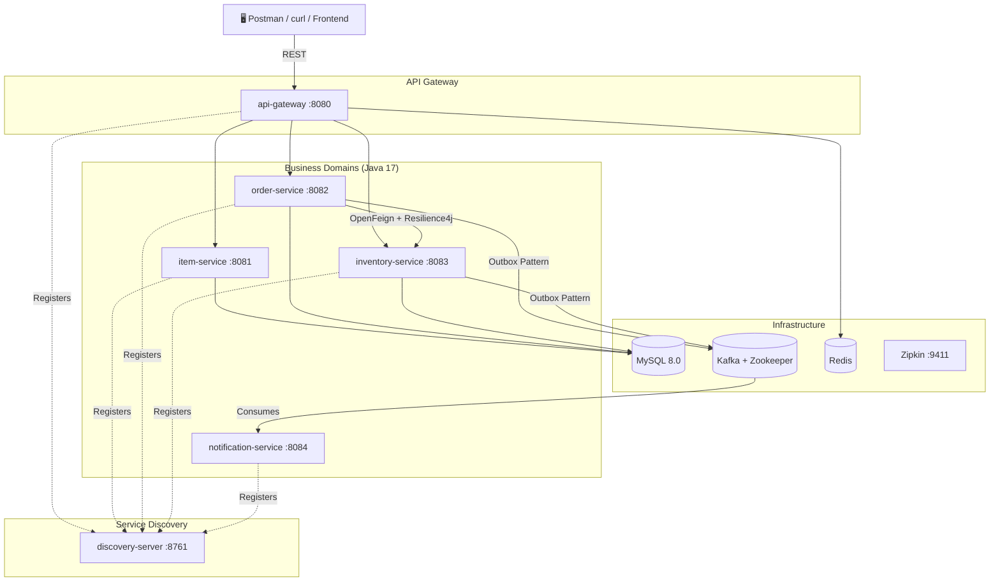

# CNKart Enterprise Microservices Platform

[](https://github.com/byte2code/cnkart/actions/workflows/ci.yml)
[](https://www.oracle.com/java/technologies/javase/jdk17-archive-downloads.html)
[](https://spring.io/projects/spring-boot)

A modern, highly resilient, event-driven microservices architecture simulating an enterprise e-commerce workflow. CNKart is built to demonstrate production-grade patterns such as the Transactional Outbox, Saga orchestrations, Idempotency, and API Gateway patterns.

---

## 🚀 Overview: The End-to-End Product Flow

CNKart simulates the core journey of a retail platform:
1. **Cataloging**: Administrators manage catalog products (`item`).
2. **Purchasing & Idempotency**: A user checks out via an API Gateway. The `order` service accepts the request idempotently to prevent accidental duplicate charges.
3. **Pessimistic Inventory**: The `order` service synchronously asks `inventory` to lock and reserve the exact stock.
4. **Guaranteed Delivery via Outbox**: On successful reservation, the order is confirmed and written to a database outbox in the same transaction. A background poller streams this outbox into **Apache Kafka**, guaranteeing delivery without dual-write tearing.
5. **Asynchronous Notifications**: The `notification-service` consumes Kafka streams to inform users of order creation and inventory rejections decoupled from the main HTTP thread.

---

## 🏗️ Architecture Design

CNKart routes all traffic through a centralized gateway to independent business domain services. 


```mermaid
flowchart TB
    Client["🖥️ Postman / curl / Frontend"]

    subgraph Discovery["Service Discovery"]
        Eureka["discovery-server :8761"]
    end

    subgraph Gateway["API Gateway"]
        APIGateway["api-gateway :8080"]
    end

    subgraph Services["Business Domains (Java 17)"]
        Item["item-service :8081"]
        Order["order-service :8082"]
        Inventory["inventory-service :8083"]
        Notification["notification-service :8084"]
    end

    subgraph Infra["Infrastructure"]
        MySQL[("MySQL 8.0")]
        Kafka[("Kafka + Zookeeper")]
        Redis[("Redis")]
        Zipkin["Zipkin :9411"]
    end

    Client -->|REST| APIGateway
    APIGateway --> Item
    APIGateway --> Order
    APIGateway --> Inventory

    APIGateway -.->|Registers| Eureka
    Item -.->|Registers| Eureka
    Order -.->|Registers| Eureka
    Inventory -.->|Registers| Eureka
    Notification -.->|Registers| Eureka

    Order -->|"OpenFeign + Resilience4j"| Inventory

    Item --> MySQL
    Order --> MySQL
    Inventory --> MySQL
    APIGateway --> Redis

    Order -->|"Outbox Pattern"| Kafka
    Inventory -->|"Outbox Pattern"| Kafka
    
    Kafka -->|"Consumes"| Notification
```

---

## 📦 Key Enterprise Patterns Implemented

- **Transactional Outbox Pattern**: Instead of direct `kafkaTemplate.send()`, domain events (`OrderCreated`, `InventoryReserved`) are saved alongside the business entities within the same database transaction. A poller guarantees "at least once" delivery to Kafka.
- **Circuit Breaking & Fallbacks**: Utilizes `Resilience4j` around synchronous OpenFeign clients to fail fast when `inventory-service` goes down.
- **Idempotency Keys**: Network retries during checkout won't create duplicate orders. The `order-service` guarantees safe retries.
- **Distributed Tracing**: Uses `Spring Cloud Sleuth` and `Zipkin`. Every log contains `[traceId, spanId]` allowing you to trace a single request from the `api-gateway` through all downstream systems and asynchronous Kafka topics.
- **Pessimistic Locking**: `inventory-service` locks rows during reservation to eliminate race conditions (overselling items).
- **Global Exception Handling**: Features standard `@ControllerAdvice` projecting uniform `ApiError` shapes to the client across all services.
- **Automated CI/CD**: Validated on every commit via GitHub Actions (Maven matrix build).

---

## 🚦 Getting Started

### Prerequisites
- Docker & Docker Compose
- Java 17 (for manual compilation)
- Maven

### Run via Docker Compose (Zero Configuration)
The easiest way to spin up the entire ecosystem (6 Spring Boot apps + MySQL + Kafka + Redis + Zipkin).

```bash
git clone https://github.com/byte2code/cnkart.git
cd cnkart

# Start all containers in the background
docker compose up -d --build
```

### End-to-End Smoke Test
Run the included bash script to simulate the entire product lifecycle: item creation, stock check, order placement, and idempotency checks.

```bash
# Requires `curl` and `jq`
./scripts/smoke-test.sh
```

You can view tracing at [http://localhost:9411](http://localhost:9411) after running the smoke test!

---

## 📡 Services & Ports 

| Service | Port | Description |
| --- | --- | --- |
| `api-gateway` | `8080` | Entry point for all traffic. Performs rate-limiting (Redis) and tracing. |
| `item` | `8081` | Manages catalog items and pricing. |
| `order` | `8082` | Handles idempotent order creation and manages the Saga. |
| `inventory` | `8083` | Checks stock and locks quantity. |
| `notification-service` | `8084` | Consumes Kafka events asynchronously to "notify" systems. |
| `discovery-server` | `8761` | Netflix Eureka registry. |
| `zipkin` | `9411` | UI for Distributed Tracing. |

### API Documentation (Swagger/OpenAPI)
Once running, you can explore the APIs visually:
- **Item API**: [http://localhost:8081/swagger-ui.html](http://localhost:8081/swagger-ui.html)
- **Order API**: [http://localhost:8082/swagger-ui.html](http://localhost:8082/swagger-ui.html)
- **Inventory API**: [http://localhost:8083/swagger-ui.html](http://localhost:8083/swagger-ui.html)

---

## 🔄 The Kafka Event Ecosystem

All inter-domain broadcasts occur asynchronously via Apache Kafka.

| Event Topic | Producer | Consumer(s) | Trigger / Meaning |
| --- | --- | --- | --- |
| `cnkart.order.events` | `order` | `notification-service` | Fires `OrderCreated`, `OrderConfirmed`, or `OrderRolledBack`. |
| `cnkart.inventory.events` | `inventory` | `notification-service` | Fires `InventoryReserved` or `InventoryRejected`. |

### Example Event (OrderConfirmed)
```json
{
  "orderReference": "ORD-6d6f7b78-1a7d-42de-a2df-4ccdc7f72cc5",
  "idempotencyKey": "checkout-1-user-42",
  "skuCode": "1",
  "quantity": 2,
  "status": "CONFIRMED",
  "message": "Order confirmed after inventory reservation"
}
```

---

## 🗂️ Project Structure

```text
cnkart/
├── .github/workflows/         # CI/CD pipelines
├── api-gateway/               # Spring Cloud Gateway
├── discovery-server/          # Eureka registry
├── inventory/                 # Stock reservation
├── item/                      # Catalog items
├── notification-service/      # Asynchronous consumers
├── order/                     # Order lifecycle management
├── scripts/                   # Smoke tests and load tests
├── docker-compose.yml         # Local cluster orchestrator
└── README.md
```

## 🛠️ Tech Stack

- **Core**: Java 17, Spring Boot 2.7.x / 3.x, Spring Cloud 2021.x
- **Persistence**: Spring Data JPA, MySQL 8.0, Redis
- **Messaging**: Apache Kafka, Spring Kafka
- **Resilience**: Resilience4j, Spring Cloud Circuit Breaker
- **Routing & Discovery**: Spring Cloud Gateway, Netflix Eureka
- **Observability**: Spring Boot Actuator, Micrometer, Sleuth, Zipkin
- **Testing**: JUnit 5, Mockito, Testcontainers (MySQL & Kafka containers)
- **CI/CD**: GitHub Actions
