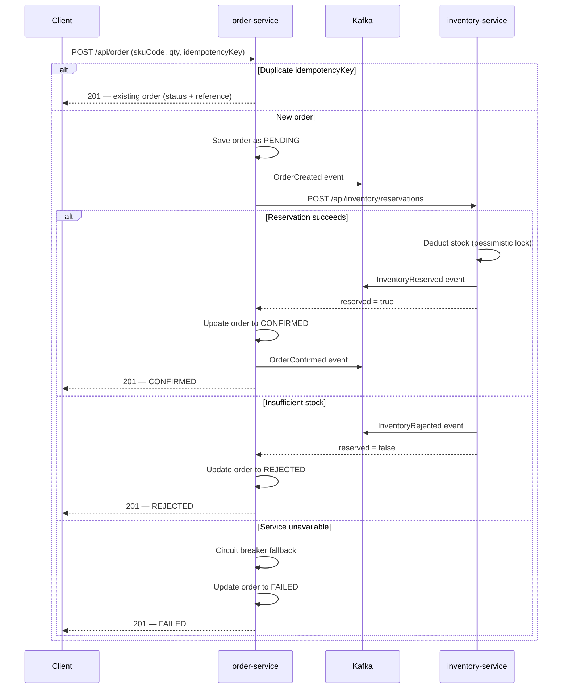
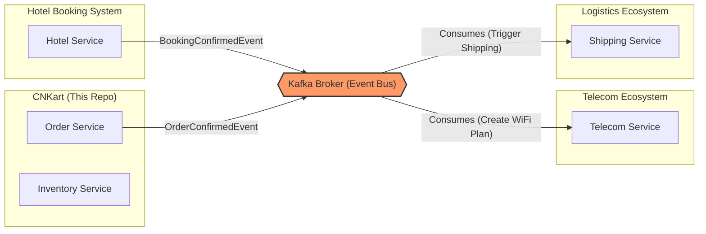

# CNKart Microservices

Spring Boot microservice suite for a simple e-commerce workflow with separate services for catalog items, inventory reservation, order placement, order lifecycle tracking, and service discovery.

## Overview

CNKart started as a monolithic REST API and is now organized as a small microservice system. The split gives each business concern its own lifecycle, which makes the project easier to reason about and a better fit for distributed-systems learning.

The services work together like this:

- `api-gateway` acts as the single entry point for all client traffic, providing rate-limiting and audit logging.
- `item` manages catalog items.
- `inventory` checks stock availability and reserves stock for an order before confirmation.
- `order` creates traceable order references, tracks order status, handles duplicate order submissions with an idempotency key, and confirms orders only after inventory reservation succeeds.
- `discovery-server` acts as the Eureka registry for the service suite.

## Quick Start

```bash
# Clone and start everything
git clone https://github.com/byte2code/cnkart.git
cd cnkart
docker compose up --build

# Run the smoke test (requires curl + jq)
./scripts/smoke-test.sh
```

The `docker-compose.override.yml` ships sensible defaults — no `.env` file is needed for a first run.

## Environment Variables

All services extract their configuration to environment variables. You must set these if running manually:
- `SPRING_DATASOURCE_URL`, `SPRING_DATASOURCE_USERNAME`, `SPRING_DATASOURCE_PASSWORD`
- `SPRING_KAFKA_BOOTSTRAP_SERVERS`
- `EUREKA_CLIENT_SERVICEURL_DEFAULTZONE`
- `SERVER_PORT`

## Concepts / Features Covered

- Spring Boot REST APIs
- Spring Data JPA persistence
- MySQL-backed service databases
- Eureka service discovery
- OpenFeign-based service-to-service communication
- Resilience4j circuit breaker fallback handling in the order flow
- Order lifecycle states: `PENDING`, `CONFIRMED`, `REJECTED`, and `FAILED`
- Idempotency key handling to avoid duplicate order creation on retries
- Inventory reservation before order confirmation
- Pessimistic locking during stock reservation to reduce overselling risk
- Explicit Saga pattern with compensating transactions (OrderRolledBack event) if inventory rejects an order
- Transactional Outbox pattern to ensure reliable event publishing (events and orders committed in a single transaction)
- Kafka domain events for order creation, inventory reservation, inventory rejection, and order confirmation
- Kafka consumer stub in order service — closes the event loop by listening to inventory events
- Generated order references for easier order tracing
- Swagger / OpenAPI documentation for order and inventory service endpoints
- `@ControllerAdvice` global error handling with structured `ApiError` responses across all business services
- `SecurityAuditFilter` in the API Gateway for logging incoming requests (IP, path, method)
- Redis-based rate limiting in the API Gateway
- Observability stack with Spring Boot Actuator, Micrometer, Spring Cloud Sleuth, and Zipkin distributed tracing
- Integration Test suite leveraging Testcontainers (MySQL, Kafka) for real environment simulation
- `docker-compose.override.yml` with env-var defaults for clone-and-run setup
- Curl-based smoke test script to verify the full system
- Service-local configuration files for each module
- Independent service startup and runtime lifecycle

## Tech Stack

- Java 8+
- Spring Boot 2.7.13
- Spring Cloud 2021.0.8
- Spring Web
- Spring Data JPA
- Spring Cloud Netflix Eureka
- Spring Cloud Gateway
- Spring Cloud OpenFeign
- Spring Cloud Circuit Breaker Resilience4j
- Spring Cloud Sleuth & Zipkin
- Spring Kafka
- springdoc-openapi (Swagger UI)
- MySQL & Redis
- Docker & Docker Compose
- Testcontainers
- Lombok

## Services

| Service | Port | Responsibility |
| --- | --- | --- |
| `discovery-server` | `8761` | Eureka registry for service registration |
| `api-gateway` | `8080` | Entry point for traffic, rate limiting, and security auditing |
| `item` | `8081` | Create and list catalog items |
| `order` | `8082` | Create idempotent orders and track status after inventory reservation |
| `inventory` | `8083` | Check stock and reserve available quantity for orders |

### Swagger UI

| Service | Swagger UI | OpenAPI JSON |
| --- | --- | --- |
| `item` | [http://localhost:8081/swagger-ui.html](http://localhost:8081/swagger-ui.html) | [http://localhost:8081/v3/api-docs](http://localhost:8081/v3/api-docs) |
| `order` | [http://localhost:8082/swagger-ui.html](http://localhost:8082/swagger-ui.html) | [http://localhost:8082/v3/api-docs](http://localhost:8082/v3/api-docs) |
| `inventory` | [http://localhost:8083/swagger-ui.html](http://localhost:8083/swagger-ui.html) | [http://localhost:8083/v3/api-docs](http://localhost:8083/v3/api-docs) |

## Architecture Diagram

```mermaid
flowchart TB
    Client["🖥️ Client / Postman / curl"]

    subgraph Discovery["Service Discovery"]
        Eureka["discovery-server :8761"]
    end

    subgraph Gateway["API Gateway"]
        APIGateway["api-gateway :8080"]
    end

    subgraph Services["Business Services"]
        Item["item-service :8081"]
        Order["order-service :8082"]
        Inventory["inventory-service :8083"]
    end

    subgraph Infra["Infrastructure"]
        MySQL[("MySQL :3306")]
        Kafka[("Kafka :9092")]
        Redis[("Redis :6379")]
        Zipkin["Zipkin :9411"]
    end

    Client --> APIGateway
    APIGateway --> Item
    APIGateway --> Order
    APIGateway --> Inventory

    APIGateway -.->|registers| Eureka
    Item -.->|registers| Eureka
    Order -.->|registers| Eureka
    Inventory -.->|registers| Eureka

    Order -->|"OpenFeign + Resilience4j"| Inventory

    Item --> MySQL
    Order --> MySQL
    Inventory --> MySQL
    APIGateway --> Redis

    Order -->|publishes (Outbox)| Kafka
    Inventory -->|publishes| Kafka
    Order -->|"consumes (Saga stub)"| Kafka
```

## Order Placement Flow


```mermaid
sequenceDiagram
    participant C as Client
    participant O as order-service
    participant K as Kafka
    participant I as inventory-service

    C->>O: POST /api/order (skuCode, qty, idempotencyKey)

    alt Duplicate idempotencyKey
        O-->>C: 201 — existing order (status + reference)
    else New order
        O->>O: Save order as PENDING
        O->>K: OrderCreated event
        O->>I: POST /api/inventory/reservations

        alt Reservation succeeds
            I->>I: Deduct stock (pessimistic lock)
            I->>K: InventoryReserved event
            I-->>O: reserved = true
            O->>O: Update order to CONFIRMED
            O->>K: OrderConfirmed event
            O-->>C: 201 — CONFIRMED
        else Insufficient stock
            I->>K: InventoryRejected event
            I-->>O: reserved = false
            O->>O: Update order to REJECTED
            O-->>C: 201 — REJECTED
        else Service unavailable
            O->>O: Circuit breaker fallback
            O->>O: Update order to FAILED
            O-->>C: 201 — FAILED
        end
    end
```

## Event Flow

| Event | Topic | Producer | Consumer | Meaning |
| --- | --- | --- | --- | --- |
| `OrderCreated` | `cnkart.order.events` | `order` | — | An order was accepted and stored in `PENDING` state |
| `OrderConfirmed` | `cnkart.order.events` | `order` | — | The order was confirmed after inventory reservation succeeded |
| `InventoryReserved/Rejected` | `cnkart.inventory.events` | `inventory` | `order` | Order service logs reservation outcome for observability |

### Event Payload Examples

**OrderCreated**

```json
{
  "orderReference": "ORD-6d6f7b78-1a7d-42de-a2df-4ccdc7f72cc5",
  "idempotencyKey": "checkout-1-user-42",
  "skuCode": "1",
  "quantity": 2,
  "status": "PENDING",
  "message": "Order created and stored in PENDING state"
}
```

**InventoryReserved**

```json
{
  "orderReference": "ORD-6d6f7b78-1a7d-42de-a2df-4ccdc7f72cc5",
  "skuCode": "1",
  "requestedQuantity": 2,
  "availableQuantity": 8,
  "eventType": "InventoryReserved",
  "message": "Inventory reserved successfully"
}
```

**InventoryRejected**

```json
{
  "orderReference": "ORD-6d6f7b78-1a7d-42de-a2df-4ccdc7f72cc5",
  "skuCode": "1",
  "requestedQuantity": 200,
  "availableQuantity": 10,
  "eventType": "InventoryRejected",
  "message": "Insufficient stock available for reservation"
}
```

**OrderConfirmed**

```json
{
  "orderReference": "ORD-6d6f7b78-1a7d-42de-a2df-4ccdc7f72cc5",
  "idempotencyKey": "checkout-1-user-42",
  "skuCode": "1",
  "quantity": 2,
  "status": "CONFIRMED",
  "message": "Order confirmed after inventory reservation"
}
```

## Cross-Repo Integration (Portfolio Architecture)

CNKart is designed to be part of a larger portfolio of microservice ecosystems, demonstrating cross-domain event-driven architecture. The various domains interact asynchronously via Kafka.


```mermaid
flowchart LR
    subgraph HotelDomain["Hotel Booking System"]
        Hotel["Hotel Service"]
    end
    
    subgraph TelecomDomain["Telecom Ecosystem"]
        Telecom["Telecom Service"]
    end
    
    subgraph EcommerceDomain["CNKart (This Repo)"]
        Order["Order Service"]
        Inventory["Inventory Service"]
    end
    
    subgraph LogisticsDomain["Logistics Ecosystem"]
        Shipping["Shipping Service"]
    end
    
    KafkaBroker{{"Kafka Broker (Event Bus)"}}
    
    Hotel -- "BookingConfirmedEvent" --> KafkaBroker
    KafkaBroker -- "Consumes (Create WiFi Plan)" --> Telecom
    
    Order -- "OrderConfirmedEvent" --> KafkaBroker
    KafkaBroker -- "Consumes (Trigger Shipping)" --> Shipping
    
    style KafkaBroker fill:#f96,stroke:#333,stroke-width:2px
```

When an order is successfully placed and confirmed in CNKart, the `OrderConfirmed` event is broadcasted. A downstream Logistics system (in another repository) can consume this event to independently trigger the shipping and delivery lifecycle without tight REST coupling.

## Order Lifecycle

| Status | Meaning |
| --- | --- |
| `PENDING` | Order command has been accepted and stored before inventory validation |
| `CONFIRMED` | Inventory reservation succeeded and stock was deducted |
| `REJECTED` | Inventory reservation was declined because stock was unavailable or invalid |
| `FAILED` | Inventory reservation failed because of an unavailable dependency or invalid order data |

## Example API Calls

### Create an item

```bash
curl -X POST http://localhost:8081/api/item \
  -H "Content-Type: application/json" \
  -d '{
    "name": "Wireless Mouse",
    "description": "2.4 GHz ergonomic mouse",
    "price": 799.00
  }'
```

Expected result:

```text
201 Created
```

### List items

```bash
curl http://localhost:8081/api/item
```

Sample response:

```json
[
  {
    "id": 1,
    "name": "Wireless Mouse",
    "description": "2.4 GHz ergonomic mouse",
    "price": 799.00
  }
]
```

### Check inventory

```bash
curl "http://localhost:8083/api/inventory?skuCode=1&qty=2"
```

Sample response:

```json
true
```

### Reserve inventory

```bash
curl -X POST http://localhost:8083/api/inventory/reservations \
  -H "Content-Type: application/json" \
  -d '{
    "orderReference": "ORD-6d6f7b78-1a7d-42de-a2df-4ccdc7f72cc5",
    "skuCode": "1",
    "quantity": 2
  }'
```

Sample response:

```json
{
  "orderReference": "ORD-6d6f7b78-1a7d-42de-a2df-4ccdc7f72cc5",
  "skuCode": "1",
  "requestedQuantity": 2,
  "availableQuantity": 8,
  "reserved": true,
  "message": "Inventory reserved successfully"
}
```

### Place an order

```bash
curl -X POST http://localhost:8082/api/order \
  -H "Content-Type: application/json" \
  -d '{
    "skuCode": "1",
    "price": 799.00,
    "quantity": 2,
    "idempotencyKey": "checkout-1-user-42"
  }'
```

Success response:

```json
{
  "orderReference": "ORD-6d6f7b78-1a7d-42de-a2df-4ccdc7f72cc5",
  "idempotencyKey": "checkout-1-user-42",
  "status": "CONFIRMED",
  "message": "Order confirmed after inventory reservation"
}
```

Rejected response:

```json
{
  "orderReference": "ORD-6d6f7b78-1a7d-42de-a2df-4ccdc7f72cc5",
  "idempotencyKey": "checkout-1-user-42",
  "status": "REJECTED",
  "message": "Insufficient stock available for reservation"
}
```

Duplicate request response:

```json
{
  "orderReference": "ORD-6d6f7b78-1a7d-42de-a2df-4ccdc7f72cc5",
  "idempotencyKey": "checkout-1-user-42",
  "status": "CONFIRMED",
  "message": "Duplicate order request detected, returning existing order status"
}
```

Use the same `idempotencyKey` when retrying the same checkout request. The order service returns the existing order instead of creating a duplicate record.

### Error response example

When an endpoint returns an error, the response follows a consistent structure across all services:

```json
{
  "timestamp": "2026-06-29T00:10:00.000+00:00",
  "status": 500,
  "error": "Internal Server Error",
  "message": "Something went wrong",
  "path": "/api/order"
}
```

## Smoke Test

The repo includes a curl-based smoke test script at `scripts/smoke-test.sh` that proves the system runs end-to-end:

```bash
# Default (localhost)
./scripts/smoke-test.sh

# Custom host
./scripts/smoke-test.sh http://192.168.1.100
```

The script exercises:

1. **Item service** — create + list items
2. **Inventory service** — stock check + reservation
3. **Order service** — place order + idempotency retry
4. **Swagger / OpenAPI** — verify docs endpoints
5. **Discovery server** — Eureka dashboard reachability

Requires `curl` and `jq`.

## Performance Baseline

The repository includes a [k6](https://k6.io/) load test script to baseline order placement performance.

To run the load test against your local setup:
```bash
k6 run scripts/k6-load-test.js
```

**Expected Baseline on Local Hardware (Docker Compose):**
- **Throughput:** ~50-100 TPS (Transactions Per Second) depending on hardware.
- **Latency (p95):** < 500ms
- **Bottlenecks:** Because of the pessimistic lock in the `inventory` service and synchronous Feign calls, throughput is intentionally constrained to ensure data consistency during order placement. In a production environment, scaling out the `order` and `inventory` instances, along with DB tuning, will improve this baseline.

## Project Structure

```text
cnkart/
├── discovery-server/          # Eureka registry
├── api-gateway/               # Spring Cloud Gateway (Rate limiting, Routing)
├── item/                      # Catalog item service
├── inventory/                 # Stock + reservation service
├── order/                     # Order placement service (Outbox + Saga)
├── docker/
│   └── mysql/
│       └── init/              # DB init scripts (creates schemas)
├── scripts/
│   ├── smoke-test.sh          # Curl-based end-to-end smoke test
│   └── k6-load-test.js        # Performance baseline test script
├── docker-compose.yml         # Full stack definition
├── docker-compose.override.yml # Env var defaults for clone-and-run
├── SERVICE_STARTUP.md         # Startup guide
├── CHANGELOG.md
├── README.md
└── .gitignore
```

Each service keeps its own `pom.xml`, `mvnw`, source tree, and configuration file so it can be built and run independently.

## How to Run

### Docker Compose (recommended)

```bash
git clone https://github.com/byte2code/cnkart.git
cd cnkart
docker compose up --build
```

The `docker-compose.override.yml` supplies default values for all environment variables, so no `.env` file is required. To customise any setting, either export the variable or create a `.env` file at the project root.

See [SERVICE_STARTUP.md](SERVICE_STARTUP.md) for the full startup guide.

### Manual Startup

1. Start MySQL and create the databases `item_service`, `inventory_service`, and `order_service`.
2. Start Kafka and make sure it is reachable on `localhost:9092`.
3. Start Redis and Zipkin.
4. Start `discovery-server` on port `8761`.
5. Start `inventory` on port `8083`.
6. Start `item` on port `8081`.
7. Start `order` on port `8082`.
8. Start `api-gateway` on port `8080`.
9. Call the endpoints above via the API gateway (`http://localhost:8080`) from Postman, curl, or any REST client.

The local configuration files currently point to `localhost` MySQL settings, so update the database username and password if your environment differs.

## Docker Compose

The repo includes Dockerfiles for each service and a root `docker-compose.yml` that starts:

- `discovery-server`
- `item`
- `inventory`
- `order`
- MySQL
- Kafka + Zookeeper

The compose setup uses environment variables so the same services can run in containers or directly from your IDE without code changes.

## Learning Highlights

- Converting a monolith into a microservice suite
- Using Eureka to register and discover services
- Calling one service from another with OpenFeign
- Keeping order placement resilient with Resilience4j fallback
- Modeling order state transitions instead of only saving successful orders
- Using idempotency keys to make retry behavior safe for checkout APIs
- Reserving inventory before confirmation instead of only checking stock availability
- Applying pessimistic locking during reservation to protect stock updates
- Returning traceable order references to support debugging and future event workflows
- Emitting Kafka events from the order and inventory services for downstream workflows
- Closing the event loop with a Kafka consumer stub in the order service
- Documenting REST APIs with Swagger / OpenAPI
- Standardising error responses with `@ControllerAdvice` and structured DTOs
- Separating service data, config, and startup responsibility
- Centralizing external access with Spring Cloud Gateway and adding Redis-based rate limiting
- Establishing distributed tracing across the ecosystem using Spring Cloud Sleuth, Zipkin, and Micrometer
- Guaranteeing reliable event publishing using the Transactional Outbox pattern
- Executing integration test suites rapidly using Testcontainers instead of mocking databases
- Practicing REST, JPA, and distributed-system wiring in one repo

## Notes

- The legacy monolithic CNKart codebase has been replaced by the microservice suite in this version.
- Configuration files are retained in each service folder for local setup.
- Build artifacts and IDE-specific files are intentionally excluded from the repository.
