# CNKart Microservices Platform

[](https://github.com/byte2code/cnkart/actions/workflows/ci.yml)
[](https://openjdk.org/projects/jdk/17/)
[](https://spring.io/projects/spring-boot)
[](https://spring.io/projects/spring-cloud)
[](https://kafka.apache.org/)
[](https://www.mysql.com/)
[](https://redis.io/)
[](https://docs.docker.com/compose/)
[](LICENSE)

---

## Table of Contents

- [Project Overview](#project-overview)
- [Tech Stack](#tech-stack)
- [High-Level Architecture](#high-level-architecture)
- [Service Catalog](#service-catalog)
- [End-to-End Request Flow](#end-to-end-request-flow)
- [Folder Structure](#folder-structure)
- [Component Responsibilities](#component-responsibilities)
- [Application Lifecycle](#application-lifecycle)
- [API Reference](#api-reference)
- [Security Architecture](#security-architecture)
- [Database Design](#database-design)
- [Event-Driven Architecture](#event-driven-architecture)
- [Outbox Pattern Deep Dive](#outbox-pattern-deep-dive)
- [Resilience & Circuit Breaking](#resilience--circuit-breaking)
- [Rate Limiting](#rate-limiting)
- [Distributed Tracing & Observability](#distributed-tracing--observability)
- [Configuration Reference](#configuration-reference)
- [Build & Run](#build--run)
- [Testing](#testing)
- [Logging](#logging)
- [Error Handling](#error-handling)
- [Design Patterns](#design-patterns)
- [Performance Optimizations](#performance-optimizations)
- [Scalability](#scalability)
- [CI/CD](#cicd)
- [Deployment Architecture](#deployment-architecture)
- [Developer Guide](#developer-guide)
- [Troubleshooting](#troubleshooting)
- [Future Improvements](#future-improvements)

---

## Project Overview

**CNKart** is a production-grade, event-driven microservices platform that models the core checkout lifecycle of a retail e-commerce system. It is architected to solve three fundamental problems that plague distributed commerce systems:

| Problem | CNKart Solution |
|---|---|
| Duplicate charges on network retry | Idempotency key enforcement per order |
| Silent data loss on Kafka producer failure | Transactional Outbox pattern with async polling |
| Overselling during concurrent checkouts | Pessimistic locking during inventory reservation |

### Business Use Case

A customer adds items to a cart and initiates checkout. CNKart handles the entire backend lifecycle:

1. **Product discovery** — `item-service` manages the catalog.
2. **Idempotent order creation** — `order-service` accepts the order request and guards against duplicate submissions via a client-supplied `idempotencyKey`.
3. **Inventory reservation** — `order-service` calls `inventory-service` over synchronous HTTP (OpenFeign). The `inventory-service` acquires a pessimistic database lock before decrementing stock to eliminate race conditions.
4. **Guaranteed event delivery** — All domain events (`OrderCreated`, `OrderConfirmed`, `InventoryReserved`) are saved to a transactional outbox table within the same DB transaction as the business entity. A background scheduler asynchronously flushes these to Kafka, eliminating the dual-write problem.
5. **Downstream notification** — `notification-service` listens to both Kafka topics and acts on every order and inventory event, providing a verified, end-to-end event contract.

### Major Features

- Unified API Gateway with Redis-backed rate limiting and full request audit logging
- Transactional Outbox pattern for guaranteed-delivery Kafka event publishing
- Pessimistic locking for race-condition-safe inventory reservation
- Resilience4j circuit breaker with automatic fallback on `inventory-service` failure
- Idempotency key enforcement for safe payment retries
- Netflix Eureka service discovery across all 6 services
- Distributed tracing with Spring Cloud Sleuth + Zipkin spanning HTTP and async Kafka boundaries
- Testcontainers-powered integration tests — no mocking of real infrastructure
- GitHub Actions CI matrix verifying every service independently on Java 17

---

## Tech Stack

| Category | Technology | Version | Purpose |
|---|---|---|---|
| Language | Java | 17 | All microservices |
| Framework | Spring Boot | 2.7.13 | Application runtime |
| Cloud Framework | Spring Cloud | 2021.0.8 | Gateway, Discovery, Feign, Sleuth |
| Build Tool | Maven | 3.x | Build, dependency management |
| Database | MySQL | 8.0 | Persistent storage per service |
| Cache | Redis | 6-alpine | API Gateway rate limiting |
| Messaging | Apache Kafka | 7.5.0 (Confluent) | Domain event streaming |
| Message Coordinator | Zookeeper | 7.5.0 (Confluent) | Kafka broker coordination |
| Service Discovery | Netflix Eureka | 2021.0.8 | Service registration & lookup |
| HTTP Client | Spring Cloud OpenFeign | 2021.0.8 | Synchronous inter-service calls |
| Resilience | Resilience4j | Spring Cloud | Circuit breaking, retry |
| API Gateway | Spring Cloud Gateway | 2021.0.8 | Routing, rate limiting, auditing |
| Tracing | Spring Cloud Sleuth + Zipkin | 2021.0.8 | Distributed trace propagation |
| Metrics | Spring Boot Actuator + Micrometer | 2.7.13 | Health checks, metrics |
| API Docs | Springdoc OpenAPI | - | Swagger UI for REST endpoints |
| Security | Spring Security (Gateway filter) | 2.7.x | Request audit logging |
| Testing | JUnit 5 + Mockito + Testcontainers | 1.19.3 | Unit & integration tests |
| Load Testing | k6 | - | Performance baseline scripts |
| Containerization | Docker + Docker Compose | - | Local cluster orchestration |
| CI/CD | GitHub Actions | - | Automated build & test pipeline |
| Code Generation | Lombok | - | Boilerplate reduction |

---

## High-Level Architecture

The platform follows a **domain-driven, event-sourced microservice** architecture. All external traffic enters through a single API Gateway. Services register with Eureka and discover each other dynamically. Domain events flow asynchronously over Kafka. Distributed traces are propagated via Sleuth headers and aggregated in Zipkin.

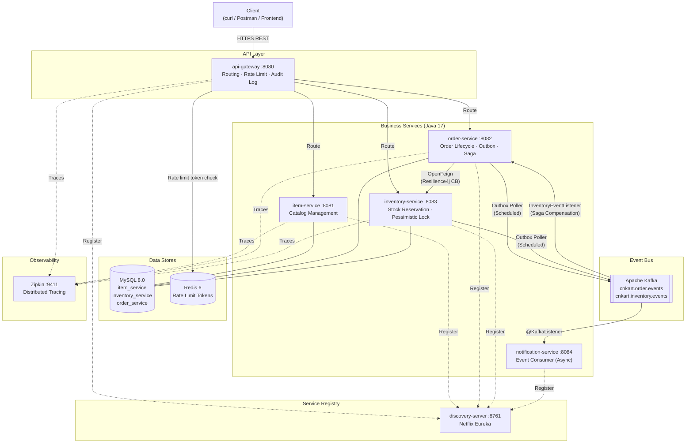
```mermaid
flowchart TB
    Client["Client\n(curl / Postman / Frontend)"]

    subgraph APILayer["API Layer"]
        GW["api-gateway :8080\nRouting · Rate Limit · Audit Log"]
    end

    subgraph Registry["Service Registry"]
        EUR["discovery-server :8761\nNetflix Eureka"]
    end

    subgraph BusinessServices["Business Services (Java 17)"]
        ITEM["item-service :8081\nCatalog Management"]
        ORDER["order-service :8082\nOrder Lifecycle · Outbox · Saga"]
        INV["inventory-service :8083\nStock Reservation · Pessimistic Lock"]
        NOTIF["notification-service :8084\nEvent Consumer (Async)"]
    end

    subgraph DataStores["Data Stores"]
        MYSQL[("MySQL 8.0\nitem_service\ninventory_service\norder_service")]
        REDIS[("Redis 6\nRate Limit Tokens")]
    end

    subgraph Messaging["Event Bus"]
        KAFKA[["Apache Kafka\ncnkart.order.events\ncnkart.inventory.events"]]
    end

    subgraph Observability["Observability"]
        ZIPKIN["Zipkin :9411\nDistributed Tracing"]
    end

    Client -->|HTTPS REST| GW
    GW -->|Route| ITEM
    GW -->|Route| ORDER
    GW -->|Route| INV

    GW -->|Rate limit token check| REDIS
    GW -.->|Register| EUR
    ITEM -.->|Register| EUR
    ORDER -.->|Register| EUR
    INV -.->|Register| EUR
    NOTIF -.->|Register| EUR

    ORDER -->|"OpenFeign\n(Resilience4j CB)"| INV

    ITEM --- MYSQL
    ORDER --- MYSQL
    INV --- MYSQL

    ORDER -->|"Outbox Poller\n(Scheduled)"| KAFKA
    INV -->|"Outbox Poller\n(Scheduled)"| KAFKA

    KAFKA -->|"@KafkaListener"| NOTIF
    KAFKA -->|"InventoryEventListener\n(Saga Compensation)"| ORDER

    ITEM -.->|Traces| ZIPKIN
    ORDER -.->|Traces| ZIPKIN
    INV -.->|Traces| ZIPKIN
    GW -.->|Traces| ZIPKIN
```

### Component Explanations

| Component | Role |
|---|---|
| `api-gateway` | Single ingress point. Enforces per-IP rate limits via Redis token bucket. Logs every incoming request (IP, method, path) and response status code via a `GlobalFilter`. Routes to downstream services using Eureka-discovered addresses. |
| `discovery-server` | Netflix Eureka registry. All services register themselves on startup and de-register on shutdown. Gateway resolves routes dynamically via service names (`ITEM-SERVICE`, `INVENTORY-SERVICE`, etc.). |
| `item-service` | CRUD service for catalog items. Exposes `POST /api/item` and `GET /api/item`. No inter-service dependencies. |
| `order-service` | Core orchestrator. Accepts idempotent checkout requests, saves the order, calls `inventory-service` over Feign, applies circuit breaker fallback, publishes domain events through the Outbox. Consumes `cnkart.inventory.events` for Saga compensations. |
| `inventory-service` | Stock management. Exposes a stock check (`GET`) and reservation (`POST`). Uses `PESSIMISTIC_WRITE` lock on the inventory row during reservation. Publishes reservation outcomes through the Outbox. |
| `notification-service` | Pure event consumer. Subscribes to both Kafka topics and logs/processes all domain events asynchronously, decoupled from the HTTP thread. |
| MySQL | Each business service owns its own schema, enforcing data isolation across domain boundaries. |
| Kafka + Zookeeper | Domain event bus. Two topics: `cnkart.order.events` and `cnkart.inventory.events`. |
| Redis | Token-bucket store for API Gateway rate limiting. Stateless services share rate-limit state through Redis. |
| Zipkin | Trace aggregation UI. Every HTTP request and Kafka message carries `traceId` and `spanId` propagated by Spring Cloud Sleuth. |

---

## Service Catalog

| Service | Port | Database | Produces Events | Consumes Events |
|---|---|---|---|---|
| `api-gateway` | 8080 | — | — | — |
| `item-service` | 8081 | `item_service` | — | — |
| `order-service` | 8082 | `order_service` | `cnkart.order.events` | `cnkart.inventory.events` |
| `inventory-service` | 8083 | `inventory_service` | `cnkart.inventory.events` | — |
| `notification-service` | 8084 | — | — | `cnkart.order.events`, `cnkart.inventory.events` |
| `discovery-server` | 8761 | — | — | — |

---

## End-to-End Request Flow

### Order Placement (Happy Path)

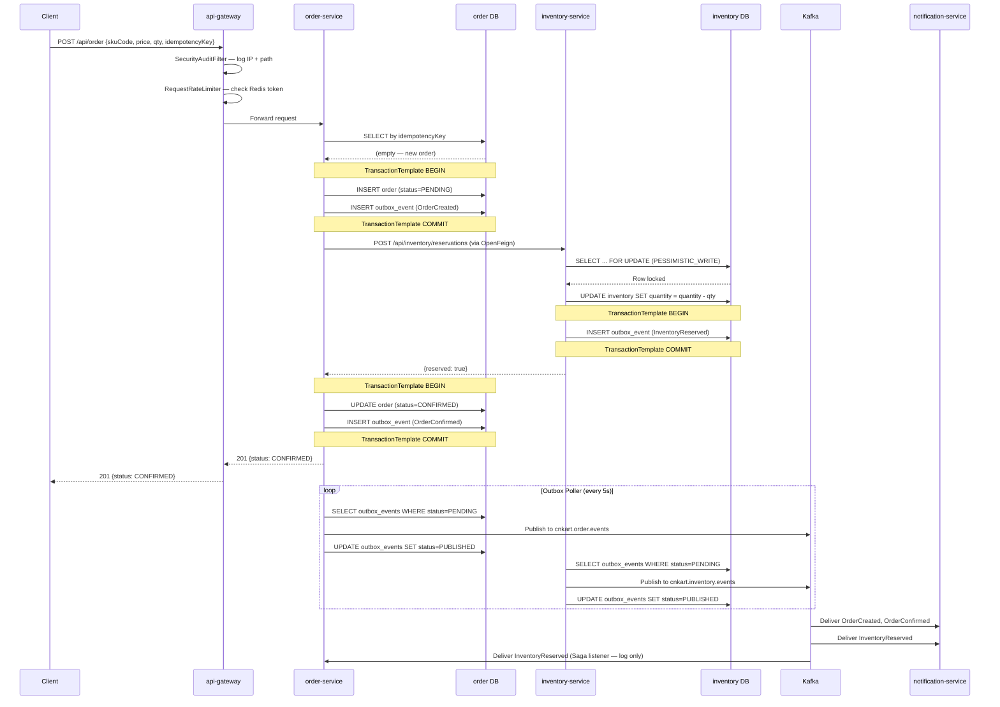
```mermaid
sequenceDiagram
    participant C  as Client
    participant GW as api-gateway
    participant O  as order-service
    participant DB_O as order DB
    participant I  as inventory-service
    participant DB_I as inventory DB
    participant K  as Kafka
    participant N  as notification-service

    C->>GW: POST /api/order {skuCode, price, qty, idempotencyKey}
    GW->>GW: SecurityAuditFilter — log IP + path
    GW->>GW: RequestRateLimiter — check Redis token
    GW->>O: Forward request
    O->>DB_O: SELECT by idempotencyKey
    DB_O-->>O: (empty — new order)
    Note over O,DB_O: TransactionTemplate BEGIN
    O->>DB_O: INSERT order (status=PENDING)
    O->>DB_O: INSERT outbox_event (OrderCreated)
    Note over O,DB_O: TransactionTemplate COMMIT
    O->>I: POST /api/inventory/reservations (via OpenFeign)
    I->>DB_I: SELECT ... FOR UPDATE (PESSIMISTIC_WRITE)
    DB_I-->>I: Row locked
    I->>DB_I: UPDATE inventory SET quantity = quantity - qty
    Note over I,DB_I: TransactionTemplate BEGIN
    I->>DB_I: INSERT outbox_event (InventoryReserved)
    Note over I,DB_I: TransactionTemplate COMMIT
    I-->>O: {reserved: true}
    Note over O,DB_O: TransactionTemplate BEGIN
    O->>DB_O: UPDATE order (status=CONFIRMED)
    O->>DB_O: INSERT outbox_event (OrderConfirmed)
    Note over O,DB_O: TransactionTemplate COMMIT
    O-->>GW: 201 {status: CONFIRMED}
    GW-->>C: 201 {status: CONFIRMED}

    loop Outbox Poller (every 5s)
        O->>DB_O: SELECT outbox_events WHERE status=PENDING
        O->>K: Publish to cnkart.order.events
        O->>DB_O: UPDATE outbox_events SET status=PUBLISHED
        I->>DB_I: SELECT outbox_events WHERE status=PENDING
        I->>K: Publish to cnkart.inventory.events
        I->>DB_I: UPDATE outbox_events SET status=PUBLISHED
    end

    K->>N: Deliver OrderCreated, OrderConfirmed
    K->>N: Deliver InventoryReserved
    K->>O: Deliver InventoryReserved (Saga listener — log only)
```

### Duplicate Order Request (Idempotency)

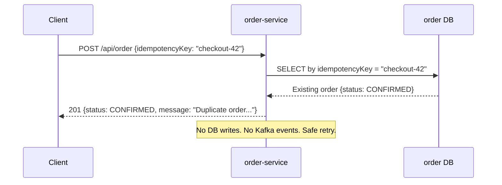
```mermaid
sequenceDiagram
    participant C  as Client
    participant O  as order-service
    participant DB as order DB

    C->>O: POST /api/order {idempotencyKey: "checkout-42"}
    O->>DB: SELECT by idempotencyKey = "checkout-42"
    DB-->>O: Existing order {status: CONFIRMED}
    O-->>C: 201 {status: CONFIRMED, message: "Duplicate order..."}
    Note over O: No DB writes. No Kafka events. Safe retry.
```

### Circuit Breaker Fallback (Inventory Down)

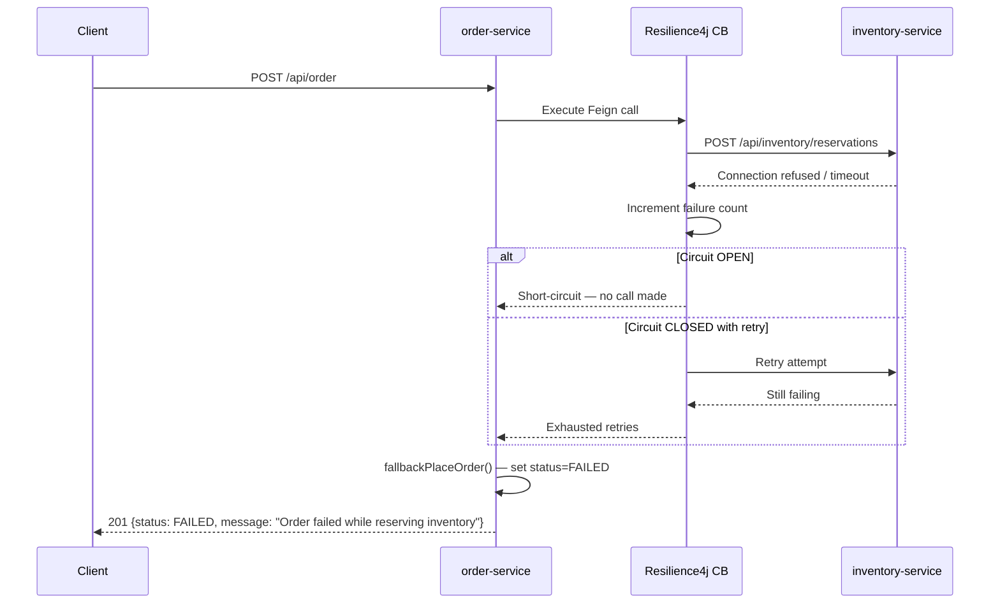
```mermaid
sequenceDiagram
    participant C  as Client
    participant O  as order-service
    participant CB as Resilience4j CB
    participant I  as inventory-service

    C->>O: POST /api/order
    O->>CB: Execute Feign call
    CB->>I: POST /api/inventory/reservations
    I-->>CB: Connection refused / timeout
    CB->>CB: Increment failure count
    alt Circuit OPEN
        CB-->>O: Short-circuit — no call made
    else Circuit CLOSED with retry
        CB->>I: Retry attempt
        I-->>CB: Still failing
        CB-->>O: Exhausted retries
    end
    O->>O: fallbackPlaceOrder() — set status=FAILED
    O-->>C: 201 {status: FAILED, message: "Order failed while reserving inventory"}
```

### Rate Limit Exceeded

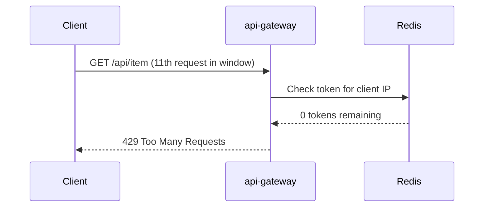
```mermaid
sequenceDiagram
    participant C  as Client
    participant GW as api-gateway
    participant R  as Redis

    C->>GW: GET /api/item (11th request in window)
    GW->>R: Check token for client IP
    R-->>GW: 0 tokens remaining
    GW-->>C: 429 Too Many Requests
```

---

## Folder Structure

```text
cnkart/
│
├── .github/
│   └── workflows/
│       └── ci.yml                   # GitHub Actions CI pipeline
│
├── api-gateway/                     # Spring Cloud Gateway
│   └── src/main/java/com/cnkart/gateway/
│       ├── ApiGatewayApplication.java
│       ├── config/
│       │   └── RateLimiterConfig.java   # KeyResolver (IP-based)
│       └── filter/
│           └── SecurityAuditFilter.java  # GlobalFilter for audit logging
│
├── discovery-server/                # Netflix Eureka registry
│   └── src/main/resources/
│       └── application.yml
│
├── item/                            # Catalog item service
│   └── src/main/java/com/cnkart/item/
│       ├── controller/ItemController.java
│       ├── service/ItemService.java
│       ├── repository/ItemRepository.java
│       ├── model/Item.java
│       ├── dto/{ItemRequest, ItemResponse}.java
│       └── exception/GlobalExceptionHandler.java
│
├── inventory/                       # Stock reservation service
│   └── src/main/java/com/cnkart/inventory/
│       ├── controller/InventoryController.java
│       ├── service/InventoryService.java
│       ├── repository/{InventoryRepository, OutboxEventRepository}.java
│       ├── model/{Inventory, OutboxEvent}.java
│       ├── event/{InventoryEventPublisher, OutboxEventPoller}.java
│       └── dto/{InventoryReservationRequest, InventoryReservationResponse}.java
│
├── order/                           # Order lifecycle + Saga orchestration
│   └── src/main/java/com/cnkart/order/
│       ├── controller/OrderController.java
│       ├── service/OrderService.java
│       ├── repository/{OrderRepository, OutboxEventRepository}.java
│       ├── model/{Order, OrderStatus, OutboxEvent}.java
│       ├── feign/InventoryService.java  # Feign client
│       ├── event/{OrderEventPublisher, OutboxEventPoller, InventoryEventListener}.java
│       └── dto/{OrderRequest, OrderResponse, InventoryReservationRequest, InventoryReservationResponse}.java
│
├── notification-service/            # Asynchronous Kafka consumer
│   └── src/main/java/com/cnkart/notification/
│       ├── NotificationApplication.java
│       └── event/KafkaConsumer.java
│
├── scripts/
│   ├── smoke-test.sh                # End-to-end curl smoke test
│   └── k6-load-test.js              # K6 performance baseline
│
├── docker/
│   └── mysql/init/
│       └── 01-create-databases.sql  # Creates inventory_service + order_service schemas
│
├── docker-compose.yml               # Full production-like stack
├── docker-compose.override.yml      # Development defaults (no .env needed)
├── CHANGELOG.md                     # Version history up to v8.0.0
├── SERVICE_STARTUP.md               # Startup guide
└── README.md
```

**Key Package Conventions:**
- `controller/` — HTTP request handling only; no business logic
- `service/` — All business logic, transaction boundaries
- `repository/` — Data access via Spring Data JPA
- `model/` — JPA entities (database row representation)
- `dto/` — Request/response objects; never expose entities directly
- `event/` — Kafka producers, outbox pollers, Kafka consumers
- `feign/` — Typed HTTP clients to other microservices
- `config/` — Spring beans, gateway configuration
- `filter/` — Gateway-level filters (audit, security)
- `exception/` — `@ControllerAdvice` global error handlers

---

## Component Responsibilities

### Controllers

| Controller | Service | Responsibility |
|---|---|---|
| `ItemController` | item | Accepts `POST /api/item` and `GET /api/item`. Delegates entirely to `ItemService`. Annotated `@Tag` for OpenAPI grouping. |
| `InventoryController` | inventory | Exposes `GET /api/inventory` (stock check) and `POST /api/inventory/reservations` (atomic reservation). |
| `OrderController` | order | Exposes `POST /api/order`. Applies `@CircuitBreaker` and `@Retry` directly on the method, triggering `fallbackPlaceOrder()` on failure. |

### Services

| Service | Key Logic |
|---|---|
| `ItemService` | Maps `ItemRequest` → `Item` entity, persists, maps result to `ItemResponse`. |
| `InventoryService` | `isInStock` — simple quantity check. `reserveStock` — acquires pessimistic lock, deducts stock transactionally, publishes reservation outcome to outbox. |
| `OrderService` | Resolves idempotency key, orchestrates the full order lifecycle using `TransactionTemplate` to keep DB writes and event publishing atomic. Handles CONFIRMED / REJECTED / FAILED state transitions. |

### Repositories

| Repository | Notes |
|---|---|
| `ItemRepository` | Extends `JpaRepository<Item, String>`. Standard CRUD. |
| `InventoryRepository` | Custom `@Query` + `@Lock(LockModeType.PESSIMISTIC_WRITE)` on `findBySkuCodeForUpdate`. |
| `OutboxEventRepository` (inventory) | Queries for PENDING outbox events; marks them PUBLISHED after Kafka delivery. |
| `OrderRepository` | `findByIdempotencyKey(String)` — used to detect duplicate submissions. |
| `OutboxEventRepository` (order) | Same pattern as inventory — queried by `OutboxEventPoller`. |

### Event Components

| Component | Service | Type | Topic | Behavior |
|---|---|---|---|---|
| `OrderEventPublisher` | order | Producer | — | Saves events to `outbox_events` table (not directly to Kafka). |
| `OutboxEventPoller` | order | `@Scheduled` | `cnkart.order.events` | Polls every 5 seconds, publishes PENDING events, updates status to PUBLISHED/FAILED. |
| `InventoryEventPublisher` | inventory | Producer | — | Saves reservation outcomes to `outbox_events`. |
| `OutboxEventPoller` | inventory | `@Scheduled` | `cnkart.inventory.events` | Same polling mechanism. |
| `InventoryEventListener` | order | `@KafkaListener` | `cnkart.inventory.events` | Saga: listens for `InventoryRejected` events; can apply compensating updates. |
| `KafkaConsumer` | notification | `@KafkaListener` | both topics | Consumes and logs all order and inventory events. |

### Feign Client

`InventoryService` (in order-service):
```java
@FeignClient(name = "INVENTORY-SERVICE")
public interface InventoryService {
    @GetMapping("/api/inventory")
    boolean isInStock(@RequestParam Long skuCode, @RequestParam Integer qty);

    @PostMapping("/api/inventory/reservations")
    InventoryReservationResponse reserveStock(@RequestBody InventoryReservationRequest request);
}
```

The service name `INVENTORY-SERVICE` is resolved dynamically via Eureka — no hardcoded URLs.

### Gateway Filters

`SecurityAuditFilter` implements `GlobalFilter`, `Ordered` (order = -1, runs first):
- Intercepts every inbound request
- Logs: `Client IP`, `HTTP Method`, `Request Path`
- Decorates the response to capture and log the returned `HTTP Status`

---

## Application Lifecycle

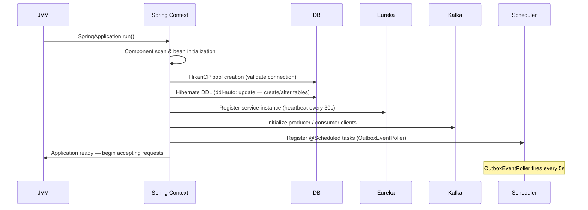
```mermaid
sequenceDiagram
    participant JVM
    participant Spring as Spring Context
    participant DB
    participant Eureka
    participant Kafka
    participant Scheduler

    JVM->>Spring: SpringApplication.run()
    Spring->>Spring: Component scan & bean initialization
    Spring->>DB: HikariCP pool creation (validate connection)
    Spring->>DB: Hibernate DDL (ddl-auto: update — create/alter tables)
    Spring->>Eureka: Register service instance (heartbeat every 30s)
    Spring->>Kafka: Initialize producer / consumer clients
    Spring->>Scheduler: Register @Scheduled tasks (OutboxEventPoller)
    Spring->>JVM: Application ready — begin accepting requests

    Note over Scheduler: OutboxEventPoller fires every 5s
```

**Key startup behaviors:**
- `HikariCP` connection pool is validated before the context is considered healthy
- Hibernate `ddl-auto: update` means schema migrations are automatic; adding a new `@Entity` field alters the table on restart
- Eureka registration happens asynchronously post-startup; there is a ~30s window before the service is discoverable
- `@Scheduled` tasks start immediately after the context is ready
- `@EnableScheduling` is declared on `InventoryApplication` and `OrderApplication`

---

## API Reference

All endpoints are accessible directly on their service port or via the API Gateway on port `8080`.

### Item Service — `http://localhost:8080/api/item`

| Method | Path | Purpose | Request Body | Response | Auth |
|---|---|---|---|---|---|
| `POST` | `/api/item` | Create a catalog item | `ItemRequest {name, description, price}` | `201 Created` | None |
| `GET` | `/api/item` | List all items | — | `200 [ItemResponse]` | None |

**Swagger UI:** [http://localhost:8081/swagger-ui.html](http://localhost:8081/swagger-ui.html)

### Inventory Service — `http://localhost:8080/api/inventory`

| Method | Path | Purpose | Parameters | Response | Auth |
|---|---|---|---|---|---|
| `GET` | `/api/inventory` | Check if stock is available | `?skuCode={id}&qty={n}` | `200 true/false` | None |
| `POST` | `/api/inventory/reservations` | Reserve stock atomically | `InventoryReservationRequest {orderReference, skuCode, quantity}` | `200 InventoryReservationResponse` | None |

**Swagger UI:** [http://localhost:8083/swagger-ui.html](http://localhost:8083/swagger-ui.html)

### Order Service — `http://localhost:8080/api/order`

| Method | Path | Purpose | Request Body | Response | Auth |
|---|---|---|---|---|---|
| `POST` | `/api/order` | Place an idempotent order | `OrderRequest {skuCode, price, quantity, idempotencyKey}` | `201 OrderResponse {orderReference, idempotencyKey, status, message}` | None |

**Swagger UI:** [http://localhost:8082/swagger-ui.html](http://localhost:8082/swagger-ui.html)

### Discovery Server

| URL | Purpose |
|---|---|
| `http://localhost:8761` | Eureka dashboard — shows all registered instances |

### Actuator (per service)

| URL | Purpose |
|---|---|
| `http://localhost:{port}/actuator/health` | Liveness / readiness probe |
| `http://localhost:{port}/actuator/info` | Service info |
| `http://localhost:{port}/actuator/metrics` | Micrometer metrics |

---

## Security Architecture

> **Note:** CNKart does not implement JWT authentication on REST endpoints at this time (inferred from implementation — no `SecurityFilterChain` in business services). Security is currently enforced at the gateway layer.

### API Gateway: SecurityAuditFilter

```java
// Runs at highest priority (order = -1)
public class SecurityAuditFilter implements GlobalFilter, Ordered {
    public Mono<Void> filter(ServerWebExchange exchange, GatewayFilterChain chain) {
        // Log: IP address, method, path
        // Decorate response to log HTTP status
    }
}
```

### API Gateway: Rate Limiting

- **Algorithm:** Token bucket via Redis `RequestRateLimiter`
- **Key:** Client remote IP address (`KeyResolver` in `RateLimiterConfig`)
- **Replenish Rate:** 10 requests/second
- **Burst Capacity:** 20 requests
- **Response on exceeded:** `429 Too Many Requests`

### CORS

CORS is managed at the Spring Cloud Gateway level. *(Specific CORS rules are not explicitly configured in the codebase — inferred from absence of `CorsConfiguration` beans.)*

### Password Encoding

Not applicable for current service-to-service communication. *(Inferred: no user authentication layer exists; would require `BCryptPasswordEncoder` if added.)*

---

## Database Design

### Schema Overview

Each service owns its schema. There is **no cross-service database join** — domain boundaries are enforced at the data layer.

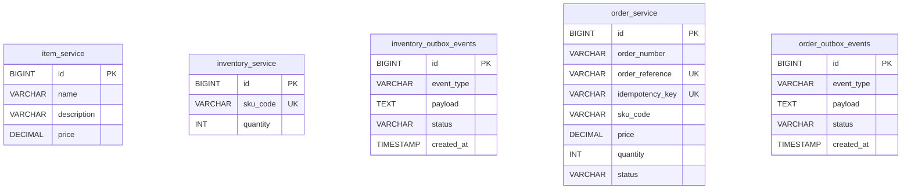
```mermaid
erDiagram
    item_service {
        BIGINT id PK
        VARCHAR name
        VARCHAR description
        DECIMAL price
    }

    inventory_service {
        BIGINT id PK
        VARCHAR sku_code UK
        INT quantity
    }

    inventory_outbox_events {
        BIGINT id PK
        VARCHAR event_type
        TEXT payload
        VARCHAR status
        TIMESTAMP created_at
    }

    order_service {
        BIGINT id PK
        VARCHAR order_number
        VARCHAR order_reference UK
        VARCHAR idempotency_key UK
        VARCHAR sku_code
        DECIMAL price
        INT quantity
        VARCHAR status
    }

    order_outbox_events {
        BIGINT id PK
        VARCHAR event_type
        TEXT payload
        VARCHAR status
        TIMESTAMP created_at
    }
```

### Key Design Decisions

| Decision | Rationale |
|---|---|
| `order_reference` is UNIQUE | Enables trace correlation across all downstream systems |
| `idempotency_key` is UNIQUE | Database-level guard — even if the service logic fails, the DB rejects duplicate inserts |
| `outbox_events.status` | Tracks `PENDING` → `PUBLISHED` / `FAILED` lifecycle for reliable delivery |
| `PESSIMISTIC_WRITE` on `inventory` | Row-level lock prevents two concurrent checkouts from both seeing the same available stock |
| `ddl-auto: update` | Automatic schema evolution on restart — acceptable for development/demo; in production, use Flyway or Liquibase |

### Transactions

```
OrderService.placeOrder():
  TransactionTemplate #1: INSERT order (PENDING) + INSERT outbox_event (OrderCreated)
  [HTTP call to inventory-service — outside any transaction]
  TransactionTemplate #2: UPDATE order (CONFIRMED/REJECTED/FAILED) + INSERT outbox_event (OrderConfirmed/OrderRolledBack)

InventoryService.reserveStock():
  @Transactional: SELECT ... FOR UPDATE + UPDATE quantity + INSERT outbox_event
```

Using `TransactionTemplate` programmatically in `OrderService` (rather than `@Transactional`) is a deliberate design: the synchronous Feign call to inventory must happen **outside** the transaction to avoid holding a DB connection open during a remote HTTP call, which would exhaust the connection pool under load.

---

## Event-Driven Architecture

### Topics

| Topic | Partitions | Events Published |
|---|---|---|
| `cnkart.order.events` | 1 (default) | `OrderCreated`, `OrderConfirmed`, `OrderRolledBack` |
| `cnkart.inventory.events` | 1 (default) | `InventoryReserved`, `InventoryRejected` |

### Event Payloads

<details>
<summary><strong>OrderCreated</strong></summary>

```json
{
  "orderReference": "ORD-6d6f7b78-1a7d-42de-a2df-4ccdc7f72cc5",
  "idempotencyKey": "checkout-1-user-42",
  "skuCode": "1",
  "quantity": 2,
  "status": "PENDING",
  "message": "Order created and stored in PENDING state"
}
```
</details>

<details>
<summary><strong>OrderConfirmed</strong></summary>

```json
{
  "orderReference": "ORD-6d6f7b78-1a7d-42de-a2df-4ccdc7f72cc5",
  "idempotencyKey": "checkout-1-user-42",
  "skuCode": "1",
  "quantity": 2,
  "status": "CONFIRMED",
  "message": "Order confirmed after inventory reservation"
}
```
</details>

<details>
<summary><strong>InventoryReserved</strong></summary>

```json
{
  "orderReference": "ORD-6d6f7b78-1a7d-42de-a2df-4ccdc7f72cc5",
  "skuCode": "1",
  "requestedQuantity": 2,
  "availableQuantity": 8,
  "eventType": "InventoryReserved",
  "message": "Inventory reserved successfully"
}
```
</details>

<details>
<summary><strong>InventoryRejected</strong></summary>

```json
{
  "orderReference": "ORD-6d6f7b78-1a7d-42de-a2df-4ccdc7f72cc5",
  "skuCode": "1",
  "requestedQuantity": 200,
  "availableQuantity": 10,
  "eventType": "InventoryRejected",
  "message": "Insufficient stock available for reservation"
}
```
</details>

---

## Outbox Pattern Deep Dive

The Transactional Outbox pattern is the cornerstone of CNKart's event reliability story. It eliminates the dual-write problem where a service might save to the database but crash before publishing to Kafka, or vice versa.

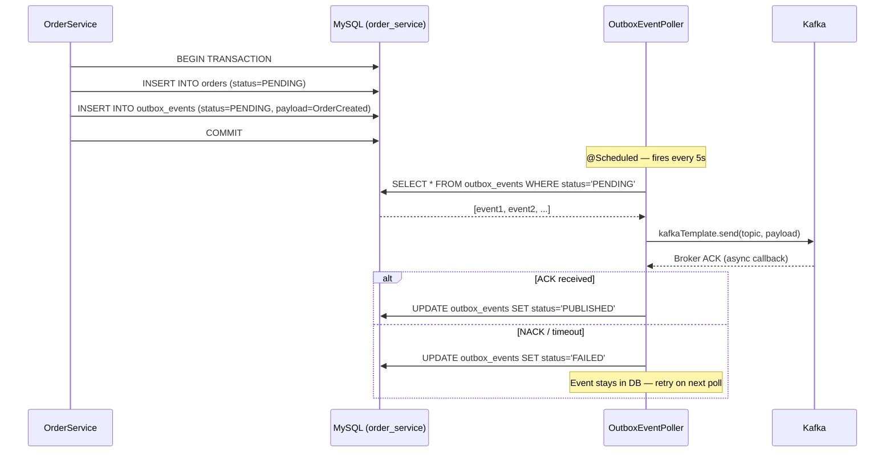
```mermaid
sequenceDiagram
    participant S  as OrderService
    participant DB as MySQL (order_service)
    participant P  as OutboxEventPoller
    participant K  as Kafka

    S->>DB: BEGIN TRANSACTION
    S->>DB: INSERT INTO orders (status=PENDING)
    S->>DB: INSERT INTO outbox_events (status=PENDING, payload=OrderCreated)
    S->>DB: COMMIT

    Note over P: @Scheduled — fires every 5s
    P->>DB: SELECT * FROM outbox_events WHERE status='PENDING'
    DB-->>P: [event1, event2, ...]
    P->>K: kafkaTemplate.send(topic, payload)
    K-->>P: Broker ACK (async callback)

    alt ACK received
        P->>DB: UPDATE outbox_events SET status='PUBLISHED'
    else NACK / timeout
        P->>DB: UPDATE outbox_events SET status='FAILED'
        Note over P: Event stays in DB — retry on next poll
    end
```

**Guarantee:** If the application crashes after `COMMIT` but before the Kafka publish, the event remains `PENDING` in the database and will be re-published on the next poller cycle.

**At-Least-Once Delivery:** Consumers (`notification-service`, `InventoryEventListener`) must be idempotent, as events may be published more than once in failure scenarios.

---

## Resilience & Circuit Breaking

The Resilience4j circuit breaker wraps the `order-service → inventory-service` OpenFeign call.

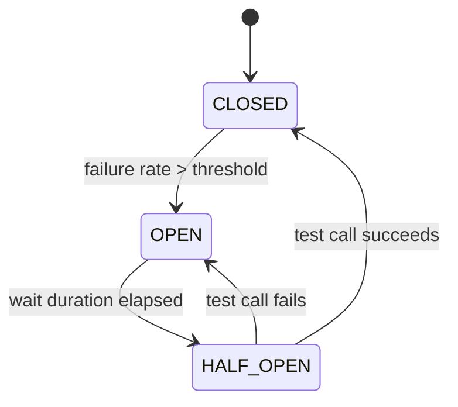
```mermaid
stateDiagram-v2
    [*] --> CLOSED
    CLOSED --> OPEN : failure rate > threshold
    OPEN --> HALF_OPEN : wait duration elapsed
    HALF_OPEN --> CLOSED : test call succeeds
    HALF_OPEN --> OPEN : test call fails
```

| State | Behavior |
|---|---|
| CLOSED | Normal — all calls go through to inventory |
| OPEN | Short-circuit — `fallbackPlaceOrder()` invoked immediately, order → `FAILED` |
| HALF_OPEN | One test request sent; determines whether to recover or stay open |

The `@Retry(name = "inventoryService")` annotation retries transient failures before the circuit breaker records them as failures.

---

## Rate Limiting

The API Gateway implements Redis-backed token bucket rate limiting:

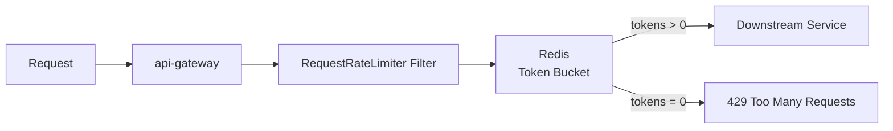
```mermaid
flowchart LR
    Request --> GW["api-gateway"]
    GW --> RL["RequestRateLimiter Filter"]
    RL --> Redis["Redis\nToken Bucket"]
    Redis -- "tokens > 0" --> DS["Downstream Service"]
    Redis -- "tokens = 0" --> Reject["429 Too Many Requests"]
```

| Parameter | Value |
|---|---|
| `redis-rate-limiter.replenishRate` | 10 requests/second |
| `redis-rate-limiter.burstCapacity` | 20 requests |
| Key resolver | Client remote IP address |

Applied to all routes: `/api/item/**`, `/api/inventory/**`, `/api/order/**`.

---

## Distributed Tracing & Observability

Spring Cloud Sleuth automatically instruments every HTTP request and Kafka message with a `traceId` and `spanId`. These headers are propagated across service boundaries.

**Log pattern (all business services):**
```
%d{HH:mm:ss} [%thread] [%X{traceId},%X{spanId}] %-5level %logger{36} - %msg%n
```

**Sample correlated log output:**
```
09:41:22 [http-nio] [abc123,def456] INFO  c.c.order.service.OrderService - Placing order ORD-xyz
09:41:22 [http-nio] [abc123,ghi789] INFO  c.c.inventory.service.InventoryService - Reserving inventory for orderReference: ORD-xyz
```

The same `traceId` (`abc123`) spans the HTTP call from order → inventory, enabling cross-service debugging in Zipkin.

**Zipkin UI:** [http://localhost:9411](http://localhost:9411) — Available after `docker compose up`.

**Sampler probability:** `1.0` (100% of traces captured — appropriate for development; reduce to `0.1` in production).

---

## Configuration Reference

### Per-Service Environment Variables

| Variable | Services | Default | Description |
|---|---|---|---|
| `SPRING_DATASOURCE_URL` | item, inventory, order | `jdbc:mysql://localhost:3306/{db}` | MySQL connection URL |
| `SPRING_DATASOURCE_USERNAME` | item, inventory, order | `root` | DB username |
| `SPRING_DATASOURCE_PASSWORD` | item, inventory, order | `root@123` | DB password |
| `SPRING_KAFKA_BOOTSTRAP_SERVERS` | inventory, order | `localhost:9092` | Kafka broker address |
| `KAFKA_BOOTSTRAP_SERVERS` | notification | `localhost:9092` | Kafka broker (notification) |
| `EUREKA_CLIENT_SERVICEURL_DEFAULTZONE` | all | `http://localhost:8761/eureka/` | Eureka endpoint |
| `EUREKA_SERVER_URL` | notification | `http://localhost:8761/eureka/` | Eureka endpoint (notification) |
| `ZIPKIN_URL` | all | `http://localhost:9411` | Zipkin tracing endpoint |
| `SERVER_PORT` | all | service default | HTTP bind port |
| `SPRING_REDIS_HOST` | api-gateway | `localhost` | Redis host |
| `SPRING_REDIS_PORT` | api-gateway | `6379` | Redis port |
| `outbox.poll.interval` | order | `5000` | Outbox polling interval (ms) |

---

## Build & Run

### Prerequisites

- Docker Desktop (recommended) or Docker Engine 20+
- Java 17 (for manual build)
- Maven 3.8+ (or use bundled `mvnw`)
- `curl` + `jq` (for smoke test)

### Docker Compose (Recommended — Zero Configuration)

```bash
# Clone the repository
git clone https://github.com/byte2code/cnkart.git
cd cnkart

# Start the full stack (MySQL, Kafka, Redis, Zipkin + all 6 services)
docker compose up -d --build

# Verify all containers are healthy
docker compose ps

# Run the end-to-end smoke test
./scripts/smoke-test.sh

# View logs for a specific service
docker compose logs -f order

# Tear down
docker compose down -v
```

### Manual Startup Order

If running services from your IDE, start in this exact sequence:

```bash
# 1. Infrastructure
docker run -d -p 3306:3306 -e MYSQL_ROOT_PASSWORD=root@123 mysql:8.0
docker run -d -p 9092:9092 confluentinc/cp-kafka:7.5.0  # simplified
docker run -d -p 6379:6379 redis:6-alpine
docker run -d -p 9411:9411 openzipkin/zipkin

# 2. Create databases
mysql -u root -proot@123 -e "CREATE DATABASE inventory_service; CREATE DATABASE order_service;"

# 3. Start services in dependency order
cd discovery-server && ./mvnw spring-boot:run   # port 8761
cd item             && ./mvnw spring-boot:run   # port 8081
cd inventory        && ./mvnw spring-boot:run   # port 8083
cd order            && ./mvnw spring-boot:run   # port 8082
cd notification-service && ./mvnw spring-boot:run # port 8084
cd api-gateway      && ./mvnw spring-boot:run   # port 8080
```

### Quick API Test

```bash
# Create an item
curl -s -X POST http://localhost:8080/api/item \
  -H "Content-Type: application/json" \
  -d '{"name":"Wireless Mouse","description":"Ergonomic 2.4GHz mouse","price":799.00}'

# Place an order
curl -s -X POST http://localhost:8080/api/order \
  -H "Content-Type: application/json" \
  -d '{"skuCode":"1","price":799.00,"quantity":2,"idempotencyKey":"checkout-user42-attempt1"}'

# Retry safely (idempotency — returns same result, no duplicate)
curl -s -X POST http://localhost:8080/api/order \
  -H "Content-Type: application/json" \
  -d '{"skuCode":"1","price":799.00,"quantity":2,"idempotencyKey":"checkout-user42-attempt1"}'
```

### Load Test

```bash
# Install k6: https://k6.io/docs/get-started/installation/
k6 run scripts/k6-load-test.js
```

**Expected baseline (local Docker Compose):**
- Throughput: ~50–100 TPS
- p95 Latency: < 500ms
- Bottleneck: Pessimistic lock in `inventory-service` + synchronous Feign call

---

## Testing

### Test Strategy

| Layer | Technology | Coverage |
|---|---|---|
| Unit tests | JUnit 5 + Mockito | Service logic, business rules, idempotency, state transitions |
| Integration tests | Testcontainers + Spring Boot Test | Full database + Kafka stack in real containers |
| Smoke tests | `curl` + `jq` bash script | End-to-end API validation |
| Load tests | k6 | Performance baseline against `/api/order` |

### Unit Tests

**`OrderServiceTest`** (4 tests):
- `placeOrderConfirmsOrderWhenInventoryIsAvailable` — happy path, verifies CONFIRMED status and event publishing
- `placeOrderRejectsOrderWhenInventoryReservationIsDeclined` — verifies REJECTED path, no `publishOrderConfirmed`
- `placeOrderFailsOrderWhenInventoryReservationCallBreaks` — verifies FAILED path on `RuntimeException`
- `placeOrderReturnsExistingOrderForDuplicateIdempotencyKey` — verifies no writes or events on duplicate key

All mocks: `OrderRepository`, `OrderEventPublisher`, `InventoryService` (Feign), `TransactionTemplate` (stubbed to execute synchronously).

**`InventoryServiceTest`** (4 tests):
- Stock available / unavailable reservation scenarios
- Rejection scenarios (insufficient quantity)

### Integration Tests

Uses Testcontainers to spin up real MySQL 8.0 and Kafka containers:

```java
@SpringBootTest(webEnvironment = RANDOM_PORT)
@Testcontainers
class OrderPlacementIntegrationTest {
    @Container
    static MySQLContainer<?> mysql = new MySQLContainer<>("mysql:8.0");

    @Container
    static KafkaContainer kafka = new KafkaContainer(
        DockerImageName.parse("confluentinc/cp-kafka:7.5.0"));

    @DynamicPropertySource
    static void overrideProperties(DynamicPropertyRegistry registry) { ... }
}
```

### Running Tests

```bash
# Unit tests only (fast, no Docker needed)
cd order && ./mvnw test -Dtest="OrderServiceTest"

# All tests including integration (requires Docker)
cd order && ./mvnw clean verify

# Skip integration tests
cd order && ./mvnw clean test -DexcludedGroups=integration
```

---

## Logging

| Aspect | Detail |
|---|---|
| Framework | Logback (via Spring Boot) |
| Config | `logback-spring.xml` per service |
| Pattern | `%d{HH:mm:ss} [%thread] [%X{traceId},%X{spanId}] %-5level %logger{36} - %msg%n` |
| Trace injection | Spring Cloud Sleuth injects `traceId` + `spanId` into MDC automatically |
| Log level | INFO (default); DEBUG available via `logging.level.*` properties |
| Output | Console (stdout) — captured by Docker and forwarded to log aggregators |

---

## Error Handling

### Global Exception Handler

All business services implement `@ControllerAdvice` returning a consistent `ApiError` structure:

```json
{
  "timestamp": "2026-06-29T00:10:00.000+00:00",
  "status": 500,
  "error": "Internal Server Error",
  "message": "Something went wrong",
  "path": "/api/order"
}
```

| Exception | HTTP Status | Handled By |
|---|---|---|
| `IllegalArgumentException` | `400 Bad Request` | `GlobalExceptionHandler` |
| `RuntimeException` (inventory fallback) | `201` with `FAILED` status | `OrderController.fallbackPlaceOrder()` |
| Generic `Exception` | `500 Internal Server Error` | `GlobalExceptionHandler` |
| Rate limit exceeded | `429 Too Many Requests` | Spring Cloud Gateway `RequestRateLimiter` |

---

## Design Patterns

| Pattern | Where Used | Explanation |
|---|---|---|
| **Transactional Outbox** | `order`, `inventory` | Domain events saved in the same DB transaction as the entity; a poller delivers them to Kafka asynchronously. |
| **Saga (Choreography)** | `order` ↔ `inventory` | `InventoryEventListener` in `order-service` consumes `cnkart.inventory.events` and applies compensating transactions when inventory rejects. |
| **Circuit Breaker** | `order → inventory` Feign call | Resilience4j opens the circuit after failures, triggering the fallback method. |
| **Idempotency** | `OrderService.placeOrder()` | `idempotencyKey` checked before any write — prevents duplicate orders on client retries. |
| **Repository** | All services | Spring Data JPA abstracts all persistence; services never write SQL. |
| **Factory / Builder** | DTOs, entities | Lombok `@Builder` on entities and Feign response objects. |
| **Dependency Injection** | Entire application | Constructor injection everywhere (enforced by Spring IoC container). |
| **Template Method** | `TransactionTemplate` | Programmatic transaction demarcation with callback pattern. |
| **Observer** | Kafka consumers | `@KafkaListener` methods observe topic streams and react to domain events. |
| **Facade** | `OrderService` | Exposes a simple `placeOrder()` method that internally coordinates DB writes, HTTP calls, and event publishing. |
| **Adapter** | OpenFeign clients | `InventoryService` (Feign) adapts the remote HTTP API into a local Java interface. |
| **Strategy** | `KeyResolver` (rate limiting) | IP-based key resolution strategy injected into the rate limiter. |
| **Singleton** | All Spring beans | Default Spring scope — one instance per application context. |
| **Decorator** | `SecurityAuditFilter` | Decorates the response to capture and log the HTTP status code. |
| **Pessimistic Locking** | `InventoryRepository` | Database-level row lock strategy during reservation. |

---

## Performance Optimizations

| Optimization | Implementation | Benefit |
|---|---|---|
| Connection pooling | HikariCP (Spring Boot default) | Reuse DB connections; avoid per-request TCP overhead |
| Pessimistic locking scope | Only on `findBySkuCodeForUpdate` — not on reads | Minimizes lock contention; reads are fully concurrent |
| Async event publishing | Outbox poller decouples Kafka writes from HTTP response | HTTP response is not blocked by Kafka producer latency |
| Async callback on Kafka ACK | `ListenableFutureCallback` in `OutboxEventPoller` | Non-blocking I/O for broker acknowledgement |
| Token bucket rate limiting | Redis-backed, shared across gateway instances | O(1) rate limit evaluation with atomic Redis operations |
| Idempotency short-circuit | Return existing order before any DB write or HTTP call | Eliminates redundant work on client retries |
| Programmatic transactions | `TransactionTemplate` in `OrderService` | Avoids holding DB connections open during Feign HTTP calls |

---

## Scalability

| Concern | Current Design | Scaling Path |
|---|---|---|
| Horizontal scaling | All business services are stateless | Add instances behind the gateway; Eureka load-balances via round-robin |
| Session state | No session state — stateless REST | Add instances freely; no sticky sessions needed |
| Rate limit state | Centralized in Redis | Redis Cluster for HA; scales with read replicas |
| Kafka partitions | 1 partition per topic (default) | Increase partitions + consumer group members for parallelism |
| Database | Single MySQL instance per service | Add read replicas; consider Vitess or CockroachDB for horizontal sharding |
| Pessimistic lock bottleneck | `inventory-service` serializes concurrent reservations | Replace with optimistic locking + retry, or CRDT-based stock tracking |
| Outbox polling interval | Fixed 5s | Reduce interval or add CDC (Debezium) for sub-second delivery |

---

## CI/CD

### GitHub Actions Pipeline

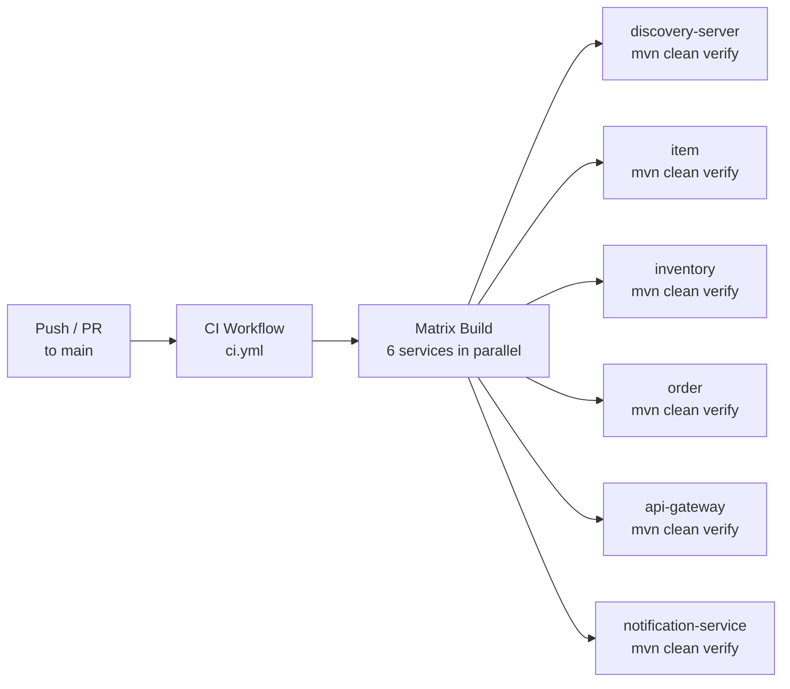
```mermaid
flowchart LR
    Push["Push / PR\nto main"] --> Trigger["CI Workflow\nci.yml"]
    Trigger --> Matrix["Matrix Build\n6 services in parallel"]
    Matrix --> A["discovery-server\nmvn clean verify"]
    Matrix --> B["item\nmvn clean verify"]
    Matrix --> C["inventory\nmvn clean verify"]
    Matrix --> D["order\nmvn clean verify"]
    Matrix --> E["api-gateway\nmvn clean verify"]
    Matrix --> F["notification-service\nmvn clean verify"]
```

**Pipeline file:** [`.github/workflows/ci.yml`](.github/workflows/ci.yml)

```yaml
strategy:
  matrix:
    service: [discovery-server, item, inventory, order, api-gateway, notification-service]

steps:
  - uses: actions/checkout@v3
  - uses: actions/setup-java@v3
    with:
      java-version: '17'
      distribution: 'temurin'
      cache: 'maven'
  - run: cd ${{ matrix.service }} && mvn -B clean verify
```

- Runs on every push and PR to `main` / `master`
- JDK 17 (Temurin) with Maven dependency cache
- Each service builds and runs all tests independently
- Integration tests use Testcontainers (requires Docker-in-Docker on the GitHub Actions runner)

---

## Deployment Architecture

### Local Development

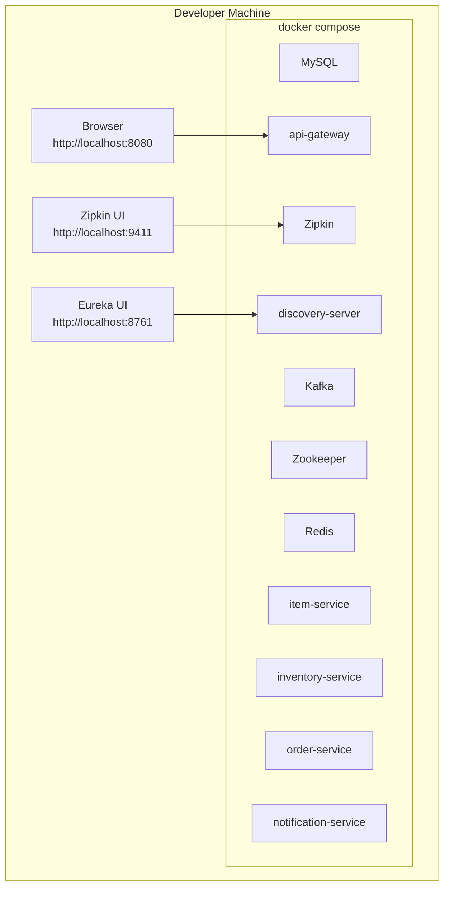
```mermaid
flowchart TB
    subgraph LocalMachine["Developer Machine"]
        subgraph DockerCompose["docker compose"]
            MySQL
            Kafka
            Zookeeper
            Redis
            Zipkin
            DiscoveryServer["discovery-server"]
            Item["item-service"]
            Inventory["inventory-service"]
            Order["order-service"]
            Notification["notification-service"]
            Gateway["api-gateway"]
        end
        Browser["Browser\nhttp://localhost:8080"]
        ZipkinUI["Zipkin UI\nhttp://localhost:9411"]
        EurekaUI["Eureka UI\nhttp://localhost:8761"]
    end
    Browser --> Gateway
    ZipkinUI --> Zipkin
    EurekaUI --> DiscoveryServer
```

### Production Target (Kubernetes — Future)

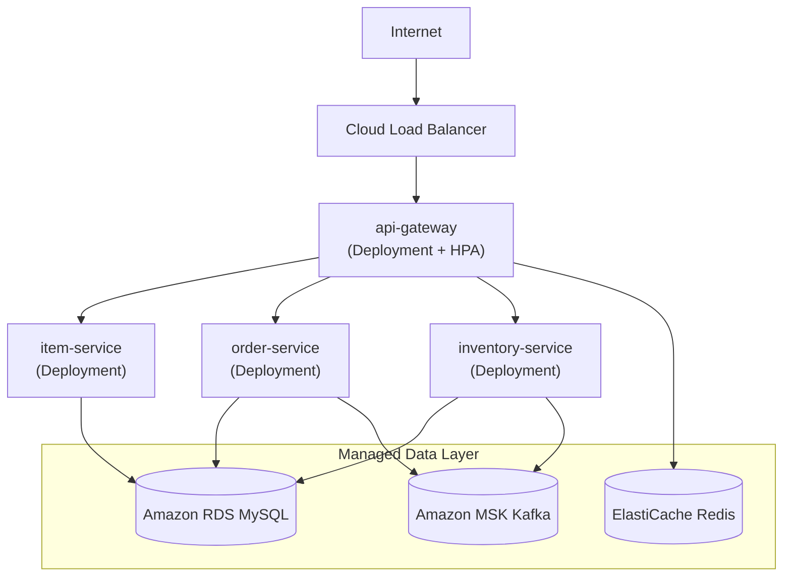
```mermaid
flowchart TB
    Internet --> LB["Cloud Load Balancer"]
    LB --> GW["api-gateway\n(Deployment + HPA)"]
    GW --> Item["item-service\n(Deployment)"]
    GW --> Order["order-service\n(Deployment)"]
    GW --> Inv["inventory-service\n(Deployment)"]

    subgraph DataLayer["Managed Data Layer"]
        RDS[("Amazon RDS MySQL")]
        ElastiCache[("ElastiCache Redis")]
        MSK[("Amazon MSK Kafka")]
    end

    Item --> RDS
    Order --> RDS
    Inv --> RDS
    GW --> ElastiCache
    Order --> MSK
    Inv --> MSK
```

---

## Developer Guide

### Adding a New REST Endpoint

1. Add the method to the appropriate `Controller` class with `@GetMapping` / `@PostMapping`.
2. Define input/output `DTO` classes in the `dto/` package.
3. Implement business logic in the `Service` layer.
4. Add a unit test in `service/YourServiceTest.java` using Mockito.
5. Add an integration test in `integration/` using Testcontainers.

### Adding a New Microservice

1. Create a new Maven module under the repo root.
2. Add `spring-boot-starter-parent 2.7.13`, Eureka client, Actuator, Sleuth, Zipkin to `pom.xml`.
3. Create `application.yml` with a unique `spring.application.name` and port.
4. Add the service to `docker-compose.yml` with environment variable overrides.
5. Add a route to `api-gateway/src/main/resources/application.yml`.
6. Add the service to the CI matrix in `.github/workflows/ci.yml`.

### Adding a New Database Table

1. Create a new `@Entity` class in the `model/` package.
2. Create a `@Repository` interface extending `JpaRepository`.
3. Hibernate `ddl-auto: update` will create the table on next startup.
4. For production: generate a Flyway/Liquibase migration instead.

### Adding a New Kafka Producer

1. Persist the event to the `outbox_events` table within the same `@Transactional` boundary as your business entity.
2. The existing `OutboxEventPoller` will pick it up and publish to Kafka.
3. Define a new topic name in `application.yml` if needed.

### Adding a New Kafka Consumer

1. Create a new `@Component` class with a `@KafkaListener(topics = "your.topic")` method.
2. Add `spring.kafka.consumer.group-id` in `application.yml`.
3. Ensure your consumer is idempotent — the Outbox pattern guarantees at-least-once delivery.

---

## Troubleshooting

### Build Failures

| Issue | Cause | Fix |
|---|---|---|
| `Cannot find symbol: TransactionTemplate` | Missing Spring TX dependency | Add `spring-boot-starter-data-jpa` to `pom.xml` |
| `Could not autowire InventoryService` | Feign client not on classpath | Add `@EnableFeignClients` to the application class |
| `IllegalStateException: Could not find a valid Docker environment` | Docker not running | Start Docker Desktop before running integration tests |

### Port Conflicts

| Port | Service | Resolution |
|---|---|---|
| `8080` | api-gateway | Stop any existing Tomcat or other gateway |
| `3306` | MySQL | Stop local MySQL: `brew services stop mysql` |
| `9092` | Kafka | Check for stale Kafka processes: `lsof -i :9092` |
| `6379` | Redis | Stop local Redis: `brew services stop redis` |

### Database Issues

```bash
# Verify MySQL databases exist
docker exec -it cnkart-mysql-1 mysql -uroot -proot@123 -e "SHOW DATABASES;"

# Re-initialize from scratch
docker compose down -v && docker compose up -d --build
```

### Kafka Issues

```bash
# List topics
docker exec cnkart-kafka-1 kafka-topics --bootstrap-server localhost:9092 --list

# Consume events manually
docker exec cnkart-kafka-1 kafka-console-consumer \
  --bootstrap-server localhost:9092 \
  --topic cnkart.order.events \
  --from-beginning
```

### Eureka Not Showing Services

Services take up to 30 seconds to register after startup. Wait and refresh [http://localhost:8761](http://localhost:8761). If still absent, check the service's Eureka URL environment variable is pointing at `http://discovery-server:8761/eureka/` (not `localhost`).

### Outbox Events Stuck as PENDING

Check the Kafka broker is reachable from the service container:
```bash
docker compose logs order | grep "outbox"
docker compose logs inventory | grep "outbox"
```

If the poller is running but events stay PENDING, verify `SPRING_KAFKA_BOOTSTRAP_SERVERS` is set to `kafka:29092` (the internal Docker network address), not `localhost:9092`.

---

## Future Improvements

| Priority | Improvement | Rationale |
|---|---|---|
| High | Flyway / Liquibase migrations | Replace `ddl-auto: update` — required for safe production schema evolution |
| High | JWT authentication | Currently no user authentication layer on REST endpoints |
| High | Optimistic locking + retry for inventory | Reduces lock contention vs. pessimistic write; better for high-throughput catalogs |
| High | Dead-letter topic (DLT) for failed Kafka events | Events marked `FAILED` in the outbox are never retried after NACK |
| Medium | Kafka topic partitioning strategy | Single partition limits consumer parallelism; partition by `skuCode` for inventory events |
| Medium | Distributed transaction tracing across Kafka | Sleuth propagates trace headers over HTTP; Kafka message headers need explicit propagation |
| Medium | Kubernetes Helm chart | Docker Compose is sufficient for development; K8s enables auto-scaling and rolling deploys |
| Medium | Grafana + Prometheus dashboard | Micrometer is wired; a dashboard would expose latency histograms and error rates |
| Medium | Order cancellation endpoint | `OrderRolledBack` event exists but no HTTP endpoint to initiate cancellation |
| Low | Event schema registry (Confluent Schema Registry) | Currently raw JSON strings — no schema enforcement or evolution safety |
| Low | CQRS for order reads | Separate read model for order history queries; current approach hits the write DB |
| Low | API versioning strategy | No versioning on REST endpoints; `/api/v1/order` pattern should be adopted before v1 release |

---

*CNKart is maintained by [byte2code](https://github.com/byte2code). Contributions welcome.*
